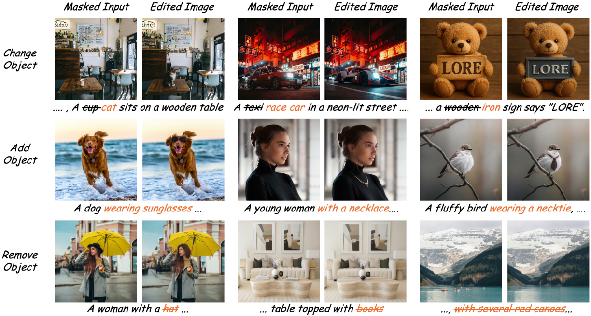

<!-- <div align="center"> -->
  
# LORE: Latent Optimization for Precise Semantic Control in Rectified Flow-based Image Editing

[Paper](https://arxiv.org/abs/2508.03144) | [Online Demo (Coming Soon)](https://github.com/oyly16/LORE) |[CyberAgent AILab](https://research.cyberagent.ai/)
-----------------------------|-----------------------------|-----------------------------




# Implementation

Our code is tested with python==3.10.0, torch==2.6.0, transformers==4.49.0, flux-dev model.

Go to [FLUX](https://github.com/black-forest-labs/flux) codebase for more requirements.

To run with local checkpoints, edit model paths in [this file](src/flux/util_lore.py). 


# Image Editing

Examples are provided in /src/run_examples.sh
```
cd src
mkdir outputs_demo
bash run_examples.sh
```

Check [this script](src/demo_lore.py) for tuning edting parameters.

# Gradio Demo

Due to limited computational resources, we will resize the images to 800 pixels (long side) while preserving the aspect ratio.

If you have more GPU memory, you can use --resize -1 to skip resize.

If you need to save image editing pairs, add --save. Samples will be saved to /src/outputs_gradio.
```
cd src
mkdir outputs_gradio
(run locally) python gradio_lore.py --resize 800
(run sharing) python gradio_lore.py --resize 800 --share
```

# Citation

If you find our work helpful, please **star 🌟** this repo and **cite 📑** our paper. Thanks for your support!

```
@article{ouyang2025lore,
  title={LORE: Latent Optimization for Precise Semantic Control in Rectified Flow-based Image Editing},
  author={Ouyang, Liangyang and Mao, Jiafeng},
  journal={arXiv preprint arXiv:2508.03144},
  year={2025}
}
```

# Acknowledgements
This work was conducted during an internship at [CyberAgent AILab](https://research.cyberagent.ai/). We thank [FLUX](https://github.com/black-forest-labs/flux/tree/main) and [RF-Edit](https://github.com/wangjiangshan0725/RF-Solver-Edit) for their clean codebase.

# Contact
If you have any questions or concerns, please send emails to [oyly@iis.u-tokyo.ac.jp](oyly@iis.u-tokyo.ac.jp).
